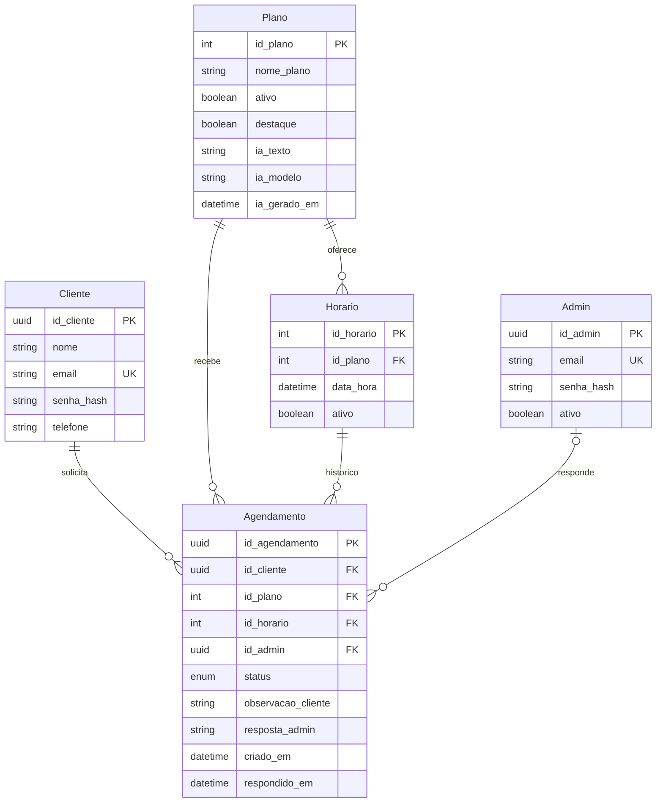

# Modelo E-R — área do cliente

Cada horário comporta uma reserva ativa. O histórico pode ter reservas canceladas
ou recusadas; um índice único parcial impede duas solicitações pendentes ou
confirmadas para a mesma vaga. As chaves estrangeiras preservam o histórico.

O administrador publica os horários; o cliente seleciona uma vaga futura. O
plano da solicitação é obtido do horário no servidor. O cliente é obtido do JWT.
As datas são guardadas como instantes UTC e apresentadas em America/Sao_Paulo.

Alunos, instrutores, treinos e pagamentos continuam como cadastros administrativos
legados. Eles não são a conta de acesso do cliente e ainda têm suas limitações de
modelagem anteriores. O fluxo novo possui cinco tabelas efetivamente relacionadas.
